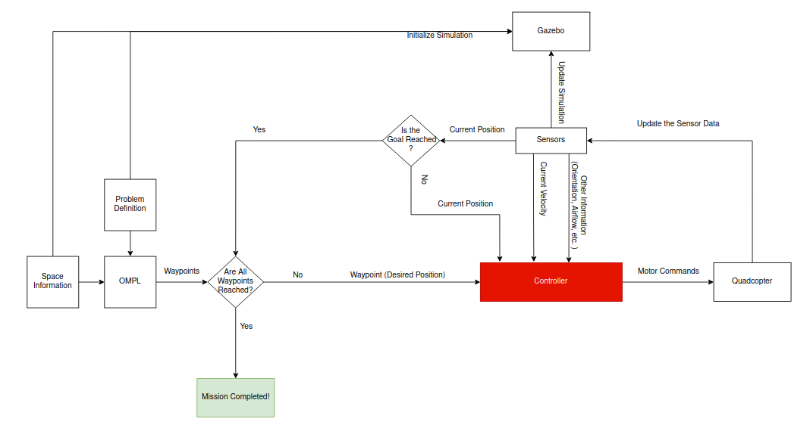
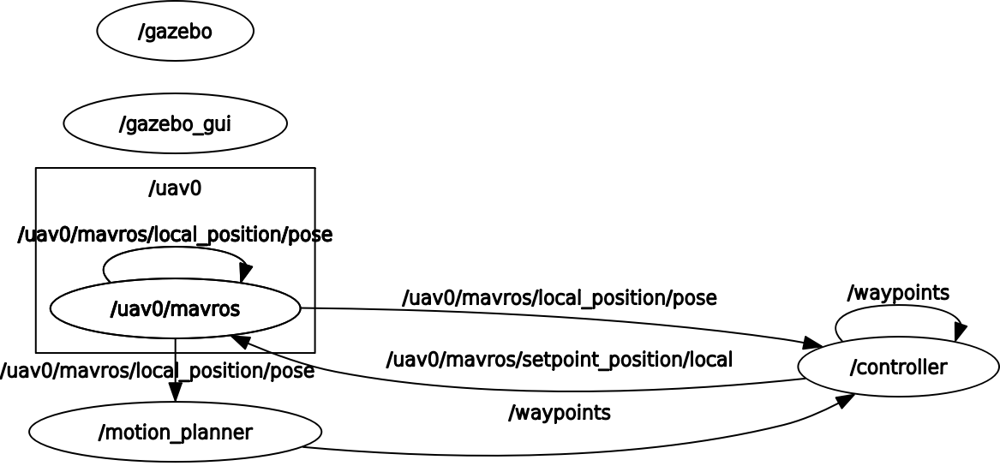

# Motion & Control Library

The Aim of this project is to create an interface to simulate a combination of different motion planners on different quadcopters (so using different controllers) on various maps. For now, the project is in its early stages and only supports a single quadcopter (iris) with a single controller (PX4) and a single motion planner (RRT* using OMPL). 

An example run: https://drive.google.com/file/d/1RxHzOKrLZaBNFIk37eyGU5mK3Vd8hqmP/view?usp=sharing

## Requirements
Ubuntu 20.04, ROS Noetic, Gazebo 9, OMPL, PX4-Autopilot

## Table of Contents

- [Installation](#installation)
- [Usage](#usage)
- [Structure](#structure)
    - [Basic System](#basic-system)
    - [Planned Functionality](#planned-functionality)
    - [Current Functionality](#current-functionality)

## Installation <a name="installation"></a>

### Install ROS Noetic, PX4-Autopilot and Gazebo 9

#### ROS Noetic

from http://wiki.ros.org/noetic/Installation/Ubuntu

#### Dependencies

```
sudo apt-get install ros-noetic-mavros ros-noetic-mavros-extras
wget https://raw.githubusercontent.com/mavlink/mavros/master/mavros/scripts/install_geographiclib_datasets.sh
sudo bash ./install_geographiclib_datasets.sh  
```
```
sudo apt install python3-pip
pip3 install --user future
pip3 install empy toml numpy packaging jinja2
pip3 install kconfiglib
pip3 install --user jsonschema
pip3 install munkres
pip3 install --user pyros-genmsg
```
```
sudo apt install python3-lxml libxml2-utils
sudo apt install python3-tk
sudo apt install libgstreamer1.0-0 gstreamer1.0-plugins-base gstreamer1.0-plugins-good gstreamer1.0-plugins-bad gstreamer1.0-plugins-ugly
sudo apt install gstreamer1.0-libav gstreamer1.0-doc gstreamer1.0-tools gstreamer1.0-x gstreamer1.0-alsa gstreamer1.0-gl gstreamer1.0-gtk3 gstreamer1.0-qt5 gstreamer1.0-pulseaudio
```
```
sudo apt-get install libgeographic-dev
sudo apt-get install geographiclib-tools
sudo apt-get install libgstreamer-plugins-base1.0-dev
```

#### PX4-Autopilot

```
git clone --branch release/1.12 https://github.com/PX4/PX4-Autopilot.git --single-branch 
cd PX4-Autopilot
mkdir build && cd build
cmake ..
make
cd ~/PX4-Autopilot
DONT_RUN=1 make px4_sitl_default gazebo
```
```
cd ~

echo "source $(pwd)/PX4-Autopilot/Tools/setup_gazebo.bash $(pwd)/PX4-Autopilot $(pwd)/PX4-Autopilot/build/px4_sitl_default" >> ~/.bashrc
echo "export ROS_PACKAGE_PATH=$ROS_PACKAGE_PATH:$(pwd)/PX4-Autopilot" >> .bashrc
echo "export ROS_PACKAGE_PATH=$ROS_PACKAGE_PATH:$(pwd)/PX4-Autopilot/Tools/sitl_gazebo" >> ~/.bashrc

source ~/.bashrc
```

### Install OMPL

```
wget https://ompl.kavrakilab.org/install-ompl-ubuntu.sh && \
chmod u+x install-ompl-ubuntu.sh
./install-ompl-ubuntu.sh --app
```

```
cd /usr/local/include
sudo mv ompl-1.5/* ./
sudo rm -rf ompl-1.5
```

```
cd ~/omplapp-1.5.2-Source/build/Release
cmake ../..                     # this command configures the build directory
make test                       # tests if library works
```

### Ready to Clone our Repository

```
cd ~
mkdir -p catkin_ws/src
cd ~/catkin_ws/src
git clone https://github.com/emirhanbayar/motion-control-lib.git
cd ~/catkin_ws
catkin_make
```

## Usage <a name="usage"></a>

### Takeoff

```
source devel/setup.bash
roslaunch quadcopter_controller gazebo.launch
```

### Run the Mission

```
source devel/setup.bash
rosrun quadcopter_controller motion_planner
```

## Structure <a name="structure"></a>

### Basic System <a name="basic-system"></a>
A diagram of the overall structure can be described as follows (drawn using [diagrams.net](https://www.diagrams.net/)):



1. A motion planner (OMPL in this case) takes space information (obstacles, bounds, etc.) and problem definition (start and goal pose, objective function, etc.) and returns waypoints to follow.

2. The controller takes a waypoint and using the sensor data calculates the necessary motor commands and sends them to the quadcopter in each frame.

3. This loop continues until all the waypoints are reached.

#### OMPL

You can refer to [this tutorial](https://ieeexplore.ieee.org/stamp/stamp.jsp?tp=&arnumber=6377468) to learn how OMPL works. Especially Figure 2 is really helpful.

#### Controller

Considering the fact that each quadcopter has its own physical and dynamic attributes, the controller is planned to be designed as a removable and pluggable black box. However, controllers have similar functionalities: 1. calculating the instant velocity vector, 2. sending motor values to get this velocity. For now, our system only supports the PX4 controller. You can examine some common controller diagrams:

- [Pixhawk4](https://docs.px4.io/main/en/flight_stack/controller_diagrams.html)

- [Crazyflie](https://www.bitcraze.io/documentation/repository/crazyflie-firmware/master/functional-areas/sensor-to-control/controllers/)

- [Ardupilot](https://ardupilot.org/dev/docs/apmcopter-programming-attitude-control-2.html)

If one is to design its own drone, she/he must design the controller as well.

### Planned Functionality <a name="planned-functionality"></a>

There will be a GUI for the user to define the space information and problem definition. The user will be able to define the obstacles (by dragging and dropping certain shapes), bounds, start and goal pose, objective function, etc. The user will also be able to select the combination of the drone (with its controller) and motion planner that she/he wants to use.

### Current Functionality <a name="current-functionality"></a>

Currently, there is only one controller (PX4 for Iris) and motion planner (RRT* in OMPL). The user can only define the start and goal pose by CLI. And place the obstacles by editing the obstacles.yaml file in the config folder. The only obstacle shape that is supported is a cylinder whose height, radius, and position can be defined in the obstacles.yaml file.

- iris_controller Class: can be found in the include/controllers/iris_controller.hpp file. It initializes the relevant topics to control the drone, and takes off the drone.

- OMPLPlanner Class: can be found in the include/planners/OMPLPlanner.hpp file. It takes problem definition from CLI, calculates the waypoints using OMPL, and publishes them to the controller one by one.

Here is the graph of information flow:




Where ellipse shaped nodes are ROS topics, and arrows are the messages with their topic names.
